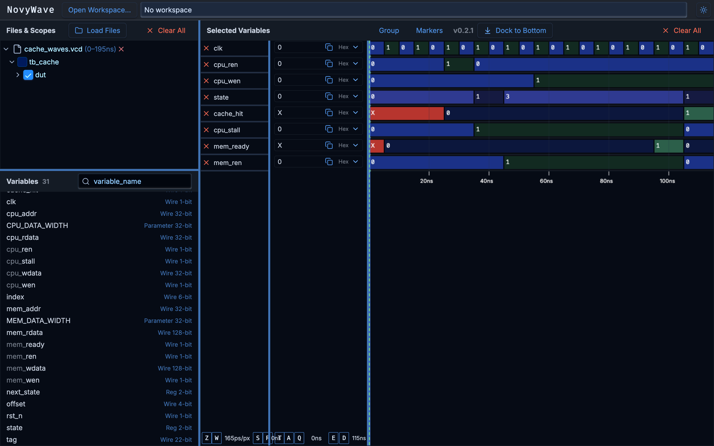

# L1 Write-Back Cache Controller (SystemVerilog)

A cycle-accurate RTL implementation of an L1 Cache Controller designed to bridge the speed gap between a high-frequency CPU and high-latency Main Memory. 

**Status:** `Phase 2: RTL Implementation Complete` | `Phase 3: Verification In Progress`

---

## 🏗️ Phase 1: Architecture & Interface Design
Before writing logic, the boundaries of the Cache Controller were defined to handle two drastically different interfaces:
* **CPU Interface:** Fast, 32-bit word requests. Strict requirement to stall the CPU (`cpu_stall`) during cache misses.
* **Memory Interface:** Slow, 128-bit (16-byte) burst transfers to maximize bus efficiency.

## 🛠️ Phase 2: RTL Implementation
The cache is divided into three parallel hardware units:

1. **Data Array (`src/data_array.sv`)**
   * 64-depth SRAM storing 128-bit blocks.
   * Synchronous writes, asynchronous reads for speculative execution.
2. **Tag Array (`src/tag_array.sv`)**
   * Stores 22-bit address fingerprints.
   * Implements a **Dirty Bit** policy to defer memory writes until eviction, preventing memory bus bottlenecking.
3. **Finite State Machine (`src/cache_top.sv`)**
   * A 4-state controller (`IDLE`, `COMPARE`, `WRITE_BACK`, `ALLOCATE`).
   * Evaluates hit/miss asynchronously and orchestrates the CPU stall and Main Memory fetch cycles.

## 🧪 Phase 3: Verification & Simulation

This cache controller was fully verified using a cycle-accurate testbench compiled with **Icarus Verilog** and analyzed using **GTKWave/NovyWave**. The testbench simulates a CPU issuing read/write requests alongside a mock Main Memory module with simulated latency.

### Waveform Analysis: Cache Miss Resolution
The waveform below demonstrates the Finite State Machine (FSM) successfully handling a cache miss, stalling the CPU, fetching data from main memory, and resolving the request.



**Chronological Breakdown:**
1. **The Request (25ns):** The CPU asserts `cpu_ren` (Read Enable).
2. **The Miss & Stall (30ns - 40ns):** The FSM transitions from `IDLE` to `COMPARE`. The Tag Array registers a miss (`cache_hit = 0`). The FSM immediately asserts `cpu_stall` to freeze the CPU pipeline.
3. **Memory Fetch (40ns - 100ns):** The FSM enters the `ALLOCATE` state. It asserts `mem_ren` to request the 16-byte block from Main Memory and waits for the response. 
4. **The Resolution (100ns):** Main memory asserts `mem_ready`. On the next clock edge, the FSM writes the fetched data to the SRAM arrays, transitions back to `COMPARE`, registers a `cache_hit`, and drops the `cpu_stall` signal, successfully resuming CPU execution.

---

## 💻 How to Run the Simulation Locally

### Prerequisites
To compile and simulate this project, you will need **Icarus Verilog**. To view the output, you will need a `.vcd` viewer like **GTKWave** or the **NovyWave** Chrome extension.

* **macOS (Homebrew):** `brew install icarus-verilog`
* **Linux (Ubuntu/Debian):** `sudo apt install iverilog gtkwave`

### 1. Compile the Source Code
Navigate to the root directory of the project and run the following command. This tells Icarus Verilog to use modern SystemVerilog syntax (`-g2012`) and compiles the testbench alongside the hardware modules into a simulation binary called `cache_sim`.

```bash
iverilog -g2012 -o cache_sim sim/tb_cache.sv src/cache_top.sv src/data_array.sv src/tag_array.sv
```

### 2. Execute the Testbench
Run the compiled binary to start the simulation. The testbench will fire read/write requests at the cache controller and dump the electrical state of every wire into a waveform file.

```bash
vvp cache_sim
```
*(Note: A successful run will output a `cache_waves.vcd` file in your root directory.)*

### 3. View the Waveforms
You can inspect the cycle-accurate execution of the state machine by opening the generated waveform data.

* **Using NovyWave:** Open the NovyWave Chrome extension and drop the `cache_waves.vcd` file into the browser.
* **Using GTKWave:** Run `gtkwave cache_waves.vcd` in your terminal.