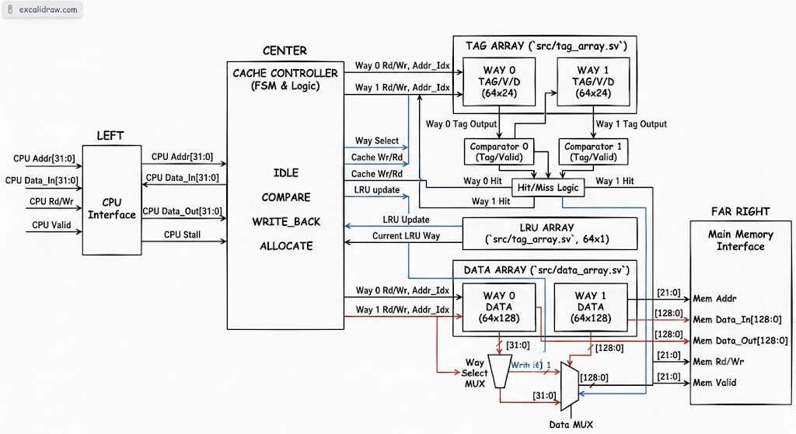
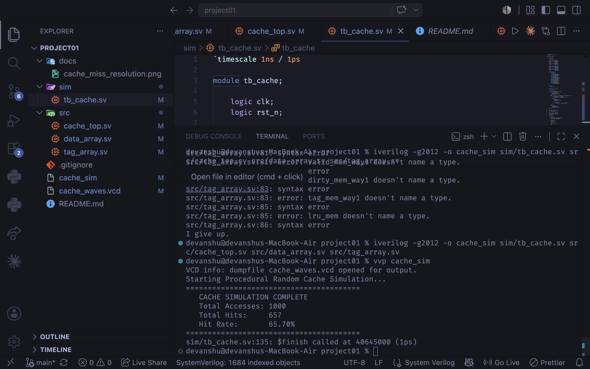
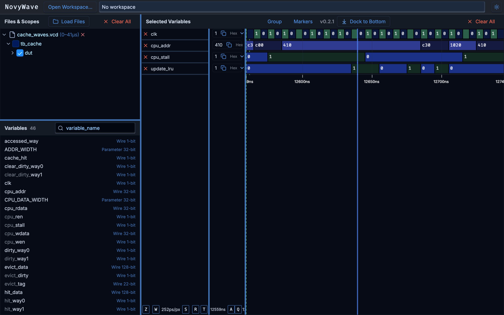

# 2-Way Set-Associative L1 Cache Controller (SystemVerilog)

[](https://github.com/devanshuvermaa/L1_cache_Project/actions/workflows/rtl_ci.yml)
*Status: Project Complete | Ready for Synthesis*

## 📖 Overview
A cycle-accurate RTL implementation of a Level 1 (L1) Cache Controller designed to bridge the speed gap between a high-frequency CPU and high-latency Main Memory. Upgraded from a direct-mapped architecture to a 2-way set-associative design to eliminate cache thrashing. This project is fully verified using a procedural random testbench and an automated cloud-based CI/CD pipeline.

## 🚀 Key Specifications
* **Architecture:** 2-Way Set-Associative
* **Replacement Policy:** Least Recently Used (LRU)
* **Write Policy:** Write-Back with Write-Allocate (Dirty Bit tracked)
* **Verification:** Constrained Procedural Random Simulation (SystemVerilog)
* **Automation:** Python verification parser & AWS EC2 Continuous Integration pipeline

---

## 🏗️ Hardware Architecture & RTL Implementation



The cache is divided into three parallel hardware units designed to evaluate hit/miss logic and fetch data simultaneously for zero-cycle latency on hits:

1. **Dual-Bank Data Array (`src/data_array.sv`)**
   * Two separate 64-depth SRAM arrays (Way 0 and Way 1) storing 128-bit blocks.
   * Performs "blind fetches" of both ways simultaneously to reduce critical path delay.
2. **Tag & LRU Array (`src/tag_array.sv`)**
   * Stores 22-bit address fingerprints, Valid bits, and Dirty bits for both ways.
   * Integrates a 64-row, 1-bit memory array to track the **Least Recently Used (LRU)** Way, seamlessly pointing the controller to the oldest data during evictions.
3. **Finite State Machine & Routing (`src/cache_top.sv`)**
   * A 4-state controller (`IDLE`, `COMPARE`, `WRITE_BACK`, `ALLOCATE`).
   * Evaluates dual comparator circuits asynchronously to determine hits.
   * Acts as a routing multiplexer to direct CPU data to the correct Way or evict dirty data to main memory.

---

## 🧪 Constrained Random Verification & Simulation

To mathematically prove the effectiveness of the LRU replacement policy, the design was tested using a **Procedural Random Testbench** rather than manual directed tests. 



The testbench generates 1,000 randomized memory transactions with the following constraints:
* **70/30 Read/Write Split:** Simulating realistic CPU instruction behaviors.
* **Forced Collisions:** The randomizer mathematically restricts the generated addresses to only 4 possible Tags across 4 possible Indexes. 
* **The Result:** By forcing 4 distinct memory addresses to constantly fight for only 2 available Ways, the testbench heavily triggers the LRU eviction logic. The controller successfully navigated this artificial traffic jam, maintaining stability and proving the eviction routing works flawlessly without locking up the FSM.

### Waveform Analysis: LRU Eviction Resolution



The waveform demonstrates the FSM resolving a cache miss by utilizing the LRU bit to overwrite the oldest data without disturbing the actively used Way. The CPU pipeline is stalled (`cpu_stall`), main memory is queried, and the controller successfully routes the incoming 128-bit block to the least recently used SRAM bank.

---

## ☁️ Automated CI/CD Pipeline (AWS & Python)

Modern hardware engineering requires continuous integration. This repository is connected to a self-hosted **AWS EC2 (Amazon Linux 2023)** runner via **GitHub Actions**.

On every `git push`, the cloud pipeline automatically:
1. Provisions a clean working directory on the AWS server.
2. Installs native `python3` and builds the `iverilog` compiler from source.
3. Compiles the SystemVerilog RTL and testbenches.
4. Executes the constrained random simulation.
5. Runs a custom Python parser (`scripts/run_and_parse.py`) to analyze the simulation logs, calculate the cache hit/miss ratio, and enforce minimum performance thresholds before allowing the build to pass.

---

## 💻 How to Run the Simulation Locally

### Prerequisites
To compile and simulate this project on your own machine, you will need **Icarus Verilog**. 

* **macOS (Homebrew):** `brew install icarus-verilog`
* **Linux (Ubuntu/Debian):** `sudo apt install iverilog gtkwave`

### 1. Compile the Source Code
Navigate to the root directory of the project and compile the logic.
```bash
iverilog -g2012 -o cache_sim sim/tb_cache.sv src/cache_top.sv src/data_array.sv src/tag_array.sv